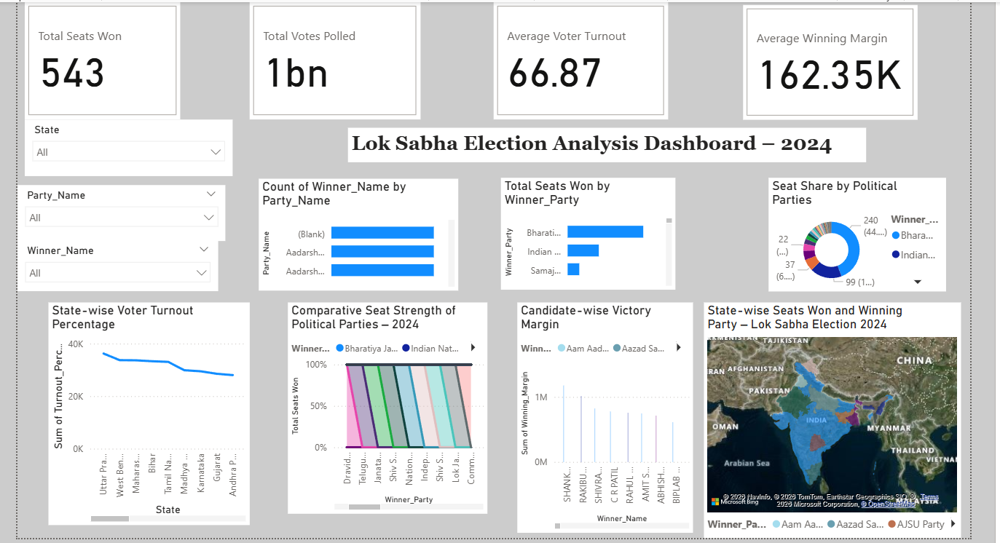

🇮🇳 Lok Sabha Election Analysis Dashboard – 2024

🚀 A data-driven analysis project showcasing visualization and insights using Power BI.

📊 Project Overview
This project presents an interactive Power BI dashboard analyzing Lok Sabha Election 2024 data. It highlights voting trends, party performance, and state-wise insights.

🔍 Key Insights
- Total Seats Won: 543
- Total Votes Polled: 1 Billion+
- Average Voter Turnout: 66.87%
- Winning Margin Analysis

📌 Features
- State-wise voter turnout analysis
- Party-wise seat distribution
- Candidate victory margin comparison
- Interactive filters (State, Party, Candidate)
- Map visualization of India

🛠 Tools Used
- Power BI
- Data Analysis
- Data Visualization

📷 Dashboard Preview

📂 Files Included
- `final_project_dvi.pbix`
- Election datasets (CSV files) 

## 🚀 How to Use
1. Download the `.pbix` file
2. Open in Power BI Desktop
3. Explore the dashboard

## 👨‍💻 Author
Naman Shukla
